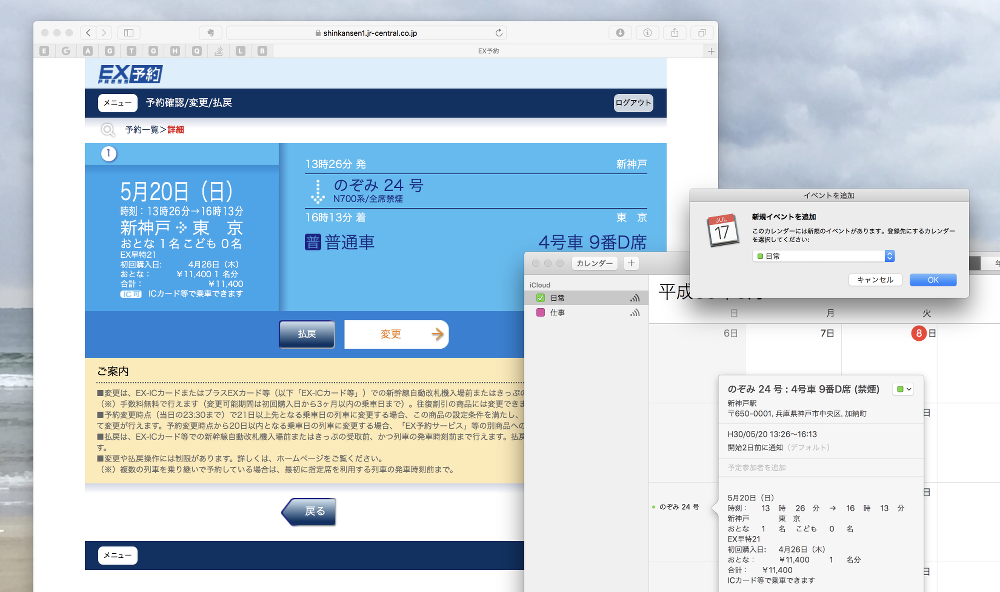

# Bookmarklet.JRExpressRideToCalendar

JR エクスプレス予約の予約内容詳細ページの情報から iCalender 形式のファイルを生成するブックマークレットです。予約した新幹線の予定をカレンダーに登録したいときに便利です。



## 動作環境

- macOS High Sierra 10.13.4
- Safari 11.1


## インストール方法

### Safari (macOS)

手作業で登録する方法 (B) は手間が多かったので、簡単に登録できるスクリプトを使う方法 (B) を用意しました。
macOS でブラウザー Safari を使っている人は使ってください。

#### A. セットアップ・スクリプトを使う方法 (macOS + Safari)

Terminal で、このリポジトリーをクローンしたディレクトリーに移動して、次のコマンドを実行します。

```sh
sh Setup/Safari.sh
```

これで Safari のブックマークに `Bookmarklet` という名前のフォルダーが作成され、その中に `エクスプレス予約からカレンダーに登録` という名前のブックマークが登録されます。

> 自身の Dropbox にスクリプトを保存して実行したい場合は、セットアップスクリプトを使うときに `sh Setup/Safari.sh dropbox Dropbox共有URL` を指定すると、それを実行できるブックマークレットが登録されます。

#### B. 手作業で登録する場合

まずは **どのページでもいい** ので、ブックマークに追加 (`⌘D`) します。

このとき、ブックマーク名を `エクスプレス予約からカレンダーに登録` など、ブックマークレットであることが分かりやすい名前に変えます。

ブックマークを登録したら、ブックマークを編集 (`⌥⌘B`) します。
そして次のコードコピーして、先ほど登録したブックマークの `アドレス` のところにペーストします。


```html
javascript:%28function%28%29%20%7B%0A%09const%20e%20%3D%20document.createElement%28%27script%27%29%3B%0A%09const%20url%20%3D%20%27https%3A//rawgit.com/es-kumagai/Bookmarklet.JRExpressRideToCalendar/master/Bookmarklet.js%27%3B%0A%09e.charset%3D%27utf-8%27%3B%0A%09e.src%3Durl%3B%0A%09document.body.appendChild%28e%29%3B%0A%7D%29%28%29
```

## 使い方

### A. 予約済みのページで使う

[エクスプレス予約のサイト](https://shinkansen1.jr-central.co.jp/) にアクセスして、そこから **予約確認/変更/払戻** 画面に移動します。
そこから、カレンダーに登録したい予約の `詳細` ボタンをクリックして、予約内容詳細のページに移動します。

このページ上で、登録したブックマークレット `エクスプレス予約からカレンダーに登録` を実行すると、その予約の iCalendar ファイルが生成されて、ダウンロードされます。
